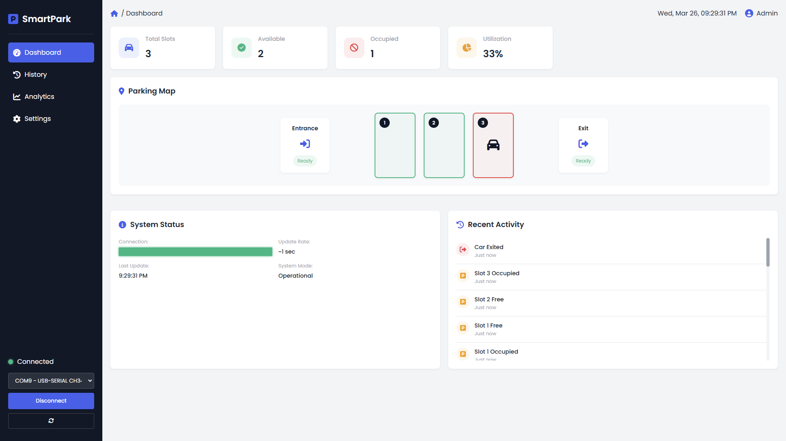
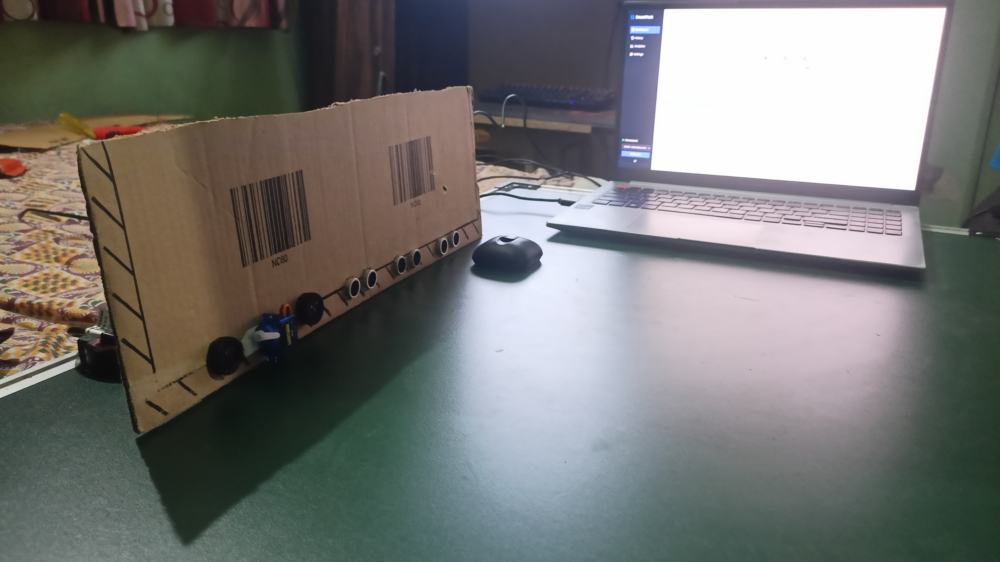

# Smart Parking System

A modern web-based dashboard for an Arduino Smart Parking System that monitors parking slots and controls entry/exit gates.




## Features

- Real-time monitoring of parking slot occupancy
- Automatic entry and exit gate control
- Beautiful and responsive web dashboard
- Easy-to-use interface with real-time updates
- Activity logging for car entry, exit, and parking events
- System status monitoring

## Requirements

### Hardware
- Arduino (Uno, Mega, Nano, etc.)
- Ultrasonic sensors (HC-SR04) x3
- IR sensors x2 (for entry and exit gates)
- Servo motor (for gate control)
- Jumper wires and breadboard

### Software
- Python 3.6+
- Flask
- PySerial
- Modern web browser

## Setup Instructions

### Arduino Setup
1. Connect the hardware components according to the pin configuration in the Arduino code:
   - Ultrasonic sensors on pins 2,3 (slot 1), 4,5 (slot 2), and 6,7 (slot 3)
   - IR sensors on pins 11 (entry) and 12 (exit) 
   - Servo on pin 8
2. Upload the provided Arduino code to your Arduino board

### Web Dashboard Setup
1. Install Python dependencies:
   ```
   pip install -r requirements.txt
   ```

2. Run the Flask application:
   ```
   python app.py
   ```

3. Open a web browser and navigate to:
   ```
   http://localhost:5000
   ```

4. In the dashboard:
   - Use the sidebar to select your Arduino port
   - Click "Connect" to establish communication
   - The dashboard will now display real-time parking data

## Usage

1. **Connecting to Arduino**: 
   - Select the correct port from the dropdown menu
   - Click "Connect" to start communication

2. **Dashboard Overview**:
   - The top cards show total slots, available slots, occupied slots, and utilization
   - The parking map shows visual representation of parking slots and gate status
   - System status section shows connection details and update rate
   - Recent activity logs entry, exit, and occupancy changes

3. **Monitoring Slots**:
   - Green slots indicate available parking spaces
   - Red slots indicate occupied spaces
   - The system automatically updates as cars enter and exit

## Troubleshooting

- **Cannot find Arduino port**: Click the refresh button to scan for available ports
- **Connection fails**: 
  - Ensure Arduino is properly connected
  - Check that the correct port is selected
  - Verify the Arduino is running the correct code
  - Restart the Flask application

## Star Me Nuts
<a href="https://www.star-history.com/#SusyBegula/park-me-nutz-iot&Date">
 <picture>
   <source media="(prefers-color-scheme: dark)" srcset="https://api.star-history.com/svg?repos=SusyBegula/park-me-nutz-iot&type=Date&theme=dark" />
   <source media="(prefers-color-scheme: light)" srcset="https://api.star-history.com/svg?repos=SusyBegula/park-me-nutz-iot&type=Date" />
   
 </picture>
</a>
